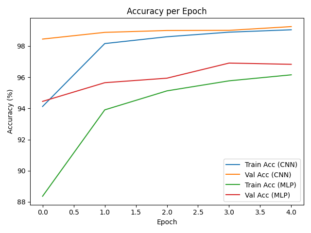
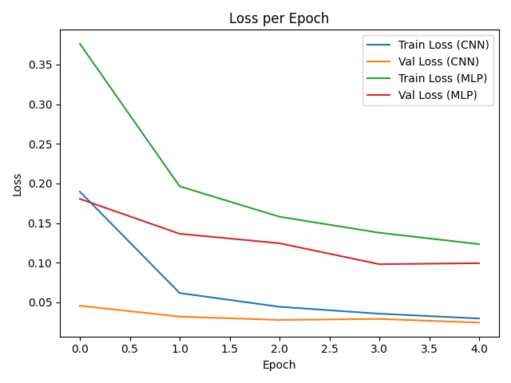
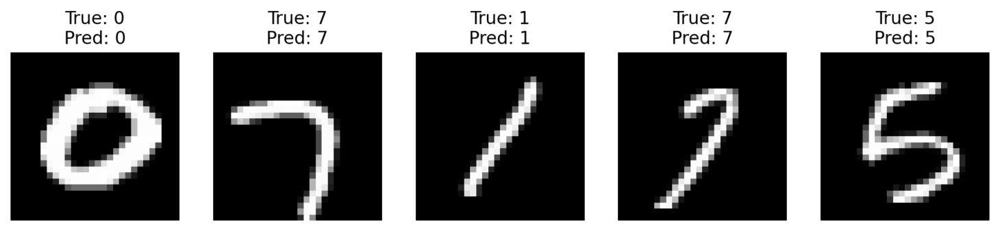
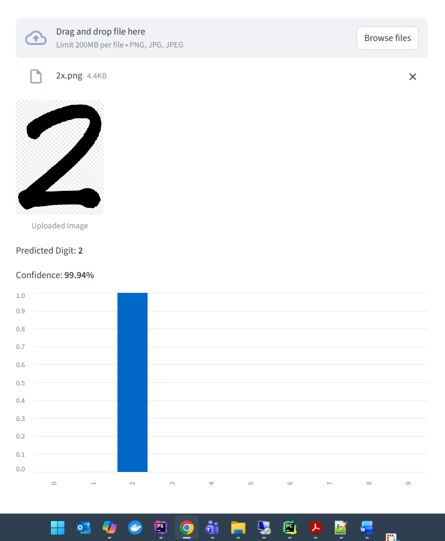

# 🖋️ MNIST Digit Classification – Deep Learning Project

## 📌 Overview
This project implements and compares two deep learning models (CNN and MLP) on the **MNIST handwritten digit dataset**.  
The best-performing model is deployed in a **Streamlit app** that allows users to upload digit images and see predictions with confidence percentages.

---

## 📂 Project Structure
```
mnist_project/
├─ model_definitions.py     # Contains CNN and MLP model classes
├─ training.py              # Training code, evaluation, saving best model
├─ app.py                   # Streamlit app for interactive predictions
├─ requirements.txt         # Dependencies list
├─ mnist_model.pth          # Saved best model weights (generated after training)
├─ best_model_name.txt      # Stores which model performed best (CNN or MLP)
├─ accuracy_curves.png      # Accuracy plot (CNN vs MLP)
├─ loss_curves.png          # Loss plot (CNN vs MLP)
├─ mnist_predictions.png    # (Optional) Predictions on random MNIST test images
├─ custom_predictions.png   # (Optional) Predictions on custom handwritten digits
├─ report.pdf               # Project report with figures and screenshots
└─ custom_images/           # Folder for your handwritten digit PNG/JPG files
```

---

## ⚙️ Installation
Clone the repository and install dependencies:

```bash
git clone https://github.com/jawadamin99/cnn_model_bia_assignment.git
cd cnn_model_bia_assignment
pip install -r requirements.txt
```

## 🧠 Models
Model A – Convolutional Neural Network (CNN)
- 2 convolutional layers (ReLU + MaxPooling)
- Flatten
- Fully connected layers
- Dropout (25%)
- Output: 10 classes (digits 0–9)
Model B – Multilayer Perceptron (MLP)
- Flatten input (28×28 → 784)
- 3 fully connected layers
- Dropout (25%)
- Output: 10 classes (digits 0–9)

## 🚀 Training
Run the training script to train both models and save the best one:
```bash
python training.py
```

This will:
- Train CNN and MLP for 5 epochs
- Compare validation accuracy
- Save the best model as mnist_model.pth
- Save plots: accuracy_curves.png and loss_curves.png

## 📊 Results
- CNN consistently outperforms MLP on MNIST.
- Accuracy and loss curves are saved as PNGs.
- Example predictions on test images and custom handwritten digits are displayed in the app.

### Training Curves


*Figure 1 – Accuracy comparison between CNN and MLP.*



*Figure 2 – Loss comparison between CNN and MLP.*

### Predictions on MNIST Test Images


*Figure 3 – Model predictions on 5 random MNIST test samples.*

### Predictions on Custom Handwritten Digits


*Figure 4 – Model predictions on uploaded handwritten digit images.*

## 🌐 Streamlit App
Run the app to interactively test the model:
```bash
streamlit run app.py
```

## Features:
- Loads the saved best model
- Tests on 5 random MNIST test images
- Upload your own digit image (PNG/JPG)
- Displays predicted digit and confidence percentage
- Shows probability distribution as a bar chart

## 🔮 Future Improvements
- Train for more epochs
- Add data augmentation
- Use learning rate scheduling
- Deploy app online (e.g., Streamlit Cloud, Hugging Face Spaces)

## 👨‍💻 Author
**Jawad Amin**

🌐 [Website](https://www.jawadamin.com)  
💼 [LinkedIn](https://www.linkedin.com/in/jawadamin99)  
📧 info@jawadamin.com
